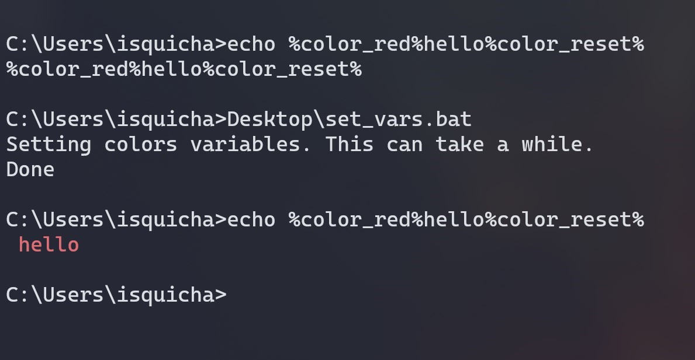
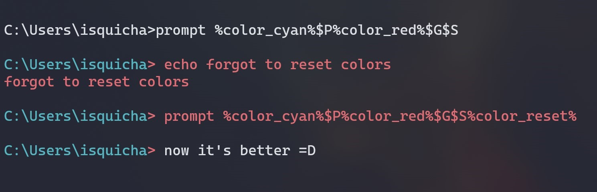
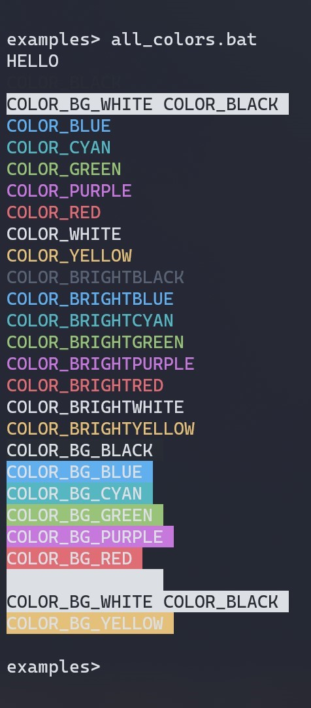

# BatchColors
Batch scripts to set colors variables for windows prompt.

## Descripion
This repository contains .bat files to set windows' colors environment variables. With those variables you can colorize your echoes or your prompt when using the cmd.

## Usage
You can:
- Set the variables for a specific session of the cmd.exe. After close the cmd.exe you will have to do it again if you want to use them.
  - Dowload [set_vars.bat](set_vars.bat)
  - Run `path\to\set_vars.bat`
- Save the variables in your user environment. You will have to do it only once per user.
  - Download [save_vars.bat](save_vars.bat)
  - Run `path\to\save_vars.bat` or
  - Double click `save_vars.bat` file.

Then, use the variable with the `%VAR_NAME%` syntax wherever you want. 
>IMPORTANT: Remember to put `%COLOR_RESET%` at the end.

### Variables list
- COLOR_BLACK
- COLOR_BLUE
- COLOR_CYAN
- COLOR_GREEN
- COLOR_PURPLE
- COLOR_RED
- COLOR_WHITE
- COLOR_YELLOW
- COLOR_BRIGHTBLACK
- COLOR_BRIGHTBLUE
- COLOR_BRIGHTCYAN
- COLOR_BRIGHTGREEN
- COLOR_BRIGHTPURPLE
- COLOR_BRIGHTRED
- COLOR_BRIGHTWHITE
- COLOR_BRIGHTYELLOW
- COLOR_BG_BLACK
- COLOR_BG_BLUE
- COLOR_BG_CYAN
- COLOR_BG_GREEN
- COLOR_BG_PURPLE
- COLOR_BG_RED
- COLOR_BG_WHITE
- COLOR_BG_YELLOW
- COLOR_RESET

## Examples
> The colors may vary according to your terminal.  
> Screenshots taken on Windows Terminal with `One Half Dark` theme, useAcrylic true
> and acrylicOpacity 0.5.

### Colored echo

>File `set_vars.bat` was on `C:\Users\isquicha\Desktop\set_vars.bat`  

>Screenshot taken before the commit that removes whitespace after colors. Ignore the whitespace before the `hello` on the output.
### Colored prompt

### All colors

>You can run the [example script](Examples/all_colors.bat).